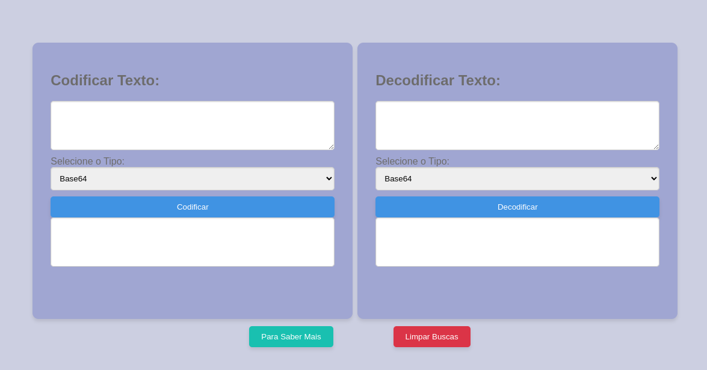
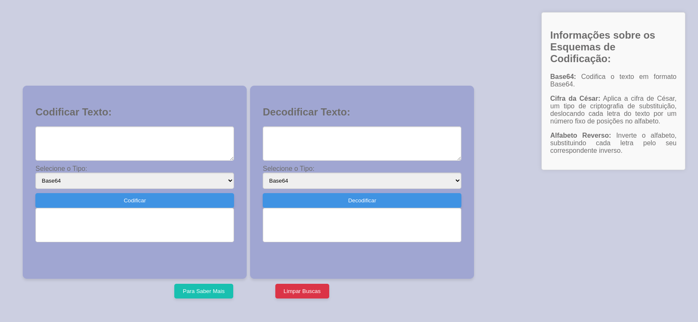

# Codificador e decodificador de texto

Este é um aplicativo da web simples que permite codificar e decodificar texto usando vários esquemas de codificação, como Base64, Cifra de César e Alfabeto Reverso.

## Características

- Codifique texto usando Base64, Cifra de César ou Alfabeto Reverso.
- Decodifique texto codificado com Base64, Cifra de César ou Alfabeto Reverso.
- Limpe as entradas com um único clique.

## Uso

1. Insira o texto que deseja codificar ou decodificar na respectiva área de texto.
2. Selecione o esquema de codificação ou decodificação no menu suspenso.
3. Clique no botão “Codificar” ou “Decodificar” para realizar a operação.
4. O resultado será exibido na área de texto de saída correspondente.
5. Utilize o botão “Limpar Buscas” para limpar todos os campos de entrada e saída.

## Aplicação

URL
<a href="https://debora1allen.github.io/encode-decode-text/" target="_blank">Clique aqui para ir para a aplicação</a>

## Instalação

Nenhuma instalação é necessária. Basta abrir o arquivo `index.html` em seu navegador para usar o aplicativo.

## Licença
[MIT](https://github.com/Debora1Allen)©[2024 debora1allen](https://github.com/Debora1Allen)

> Permission is hereby granted, free of charge, to any person obtaining a copy of this software and associated documentation files (the "Software"), to deal in the Software without restriction, including without limitation the rights to use, copy, modify, merge, publish, distribute, sublicense, and/or sell copies of the Software, and to permit persons to whom the Software is furnished to do so, subject to the following conditions:
> The above copyright notice and this permission notice shall be included in all copies or substantial portions of the Software.
> THE SOFTWARE IS PROVIDED "AS IS", WITHOUT WARRANTY OF ANY KIND, EXPRESS OR IMPLIED, INCLUDING BUT NOT LIMITED TO THE WARRANTIES OF MERCHANTABILITY, FITNESS FOR A PARTICULAR PURPOSE AND NONINFRINGEMENT. IN NO EVENT SHALL THE AUTHORS OR COPYRIGHT HOLDERS BE LIABLE FOR ANY CLAIM, DAMAGES OR OTHER LIABILITY, WHETHER IN AN ACTION OF CONTRACT, TORT OR OTHERWISE, ARISING FROM, OUT OF OR IN CONNECTION WITH THE SOFTWARE OR THE USE OR OTHER DEALINGS IN THE SOFTWARE.

---
